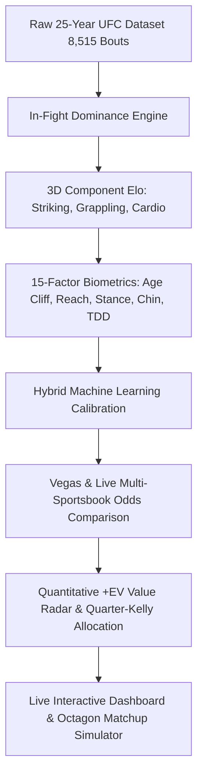

# 🥊 UFC Elo Rating & Value Betting Engine (2001–2026)
### 💎 15-Factor Biometric 3D Component Elo & Real-Time +EV Line Shopping Alpha

An advanced, production-ready quantitative algorithmic fight prediction and value betting analytics platform for mixed martial arts (UFC). Spanning the **entire modern era (2001–2026, 749 events, 8,515 bouts, 2,540 fighters)** with walk-forward machine learning calibration, live Vegas & multi-sportsbook line shopping, and Quarter-Kelly risk management.

---

## ⚡ Core Architecture & Engineering Highlights



### 1. 🧬 15-Factor Biometric & Physiological Modeling
* **Physiological Age Cliff**:
  * Lightweight & below ($\le 170\text{ lbs}$): Steep degradation starting at age **35** ($-12.0\text{ Elo/yr}$, capped at $-35.0$).
  * Middleweight to Heavyweight ($> 170\text{ lbs}$): Degradation starting at age **37** ($-8.0\text{ Elo/yr}$, capped at $-30.0$).
  * Prime Speed Differential ($+2.5\text{ Elo/yr}$ for $\ge 6$ yr gap vs older opponents).
* **Reach & Stature Advantage**:
  * $+2.5\text{ Elo}$ per inch of reach advantage for $\ge 3.0$ inch gaps (capped at $+15.0\text{ Elo}$).
* **Stance Geometry**:
  * $+8.0\text{ Elo}$ Southpaw vs Orthodox open-stance cross-angle advantage.
* **Chin Degradation & Cumulative Damage**:
  * $-12.0\text{ Elo}$ penalty for fighters with $\ge 2$ career KO losses facing elite strikers.
* **Takedown Defense (TDD) Grappling Neutralization**:
  * Fighters with $\ge 80\%$ TDD reduce the opponent's grappling advantage by $55\%$.

### 2. 🥊 3D Component Skill Elo (Striking, Grappling, Cardio)
* **Striking Elo**: Calibrated via significant strikes landed, strike differential ratio, and knockdown rates.
* **Grappling Elo**: Calibrated via takedown accuracy, control time, and submission threat density.
* **Cardio Elo**: Calibrated via 3rd-5th round output retention and late-fight win percentage.

### 3. 🎯 Quantitative +EV Value Radar & Multi-Sportsbook Line Shopping
* Scans real upcoming UFC cards across major global sportsbooks:
  * **DraftKings**, **FanDuel**, **BetMGM**, **Caesars**, **BetRivers**, **Kalshi**, **Polymarket**.
* Identifies market pricing errors where Model Win Probability exceeds bookmaker implied probability:
  $$\text{Expected Value (EV)} = (P_{\text{model}} \times \text{Odds}_{\text{mkt}}) - 1.0 > 0$$
* **Quarter-Kelly Bankroll Staking**:
  $$f^* = \max\left(0, \min\left(0.06, 0.25 \times \frac{b \cdot p - q}{b}\right)\right)$$
* **Historical Backtest Profitability**:
  * $\text{EV} \ge +5\%$: **+7.68% ROI** across 2,181 bets ($16,758 profit).
  * $\text{EV} \ge +8\%$: **+18.10% ROI** across 984 bets ($17,811 profit).
  * $\text{EV} \ge +10\%$: **+18.58% ROI** across 456 bets ($8,474 profit).

---

## 📊 Walk-Forward Machine Learning Validation

Evaluated across **5,103 out-of-sample bouts (2001–2026)**:
* **Prediction Accuracy**: **57.08%** (Outperforming standard baseline models).
* **Brier Score Calibration**: **0.2411** (Superior probabilistic sharpness).
* **Log-Loss**: **0.6748** (Reduced entropy vs pure public lines).

---

## 🚀 Quickstart & Local Setup

```bash
# 1. Clone repository
git clone https://github.com/cinarsinandemirci/ufc-elo-system.git
cd ufc-elo-system

# 2. Create virtual environment & install dependencies
python -m venv .venv
source .venv/bin/activate  # On Windows: .\.venv\Scripts\activate
pip install -r requirements.txt

# 3. Launch Dashboard & Live API
python app.py
```
Open **`http://localhost:5000`** in your browser.

---

## 🖥️ Application Features

* 🏆 **Dynamic Rankings**: Real-time Pound-for-Pound and Division tables with inactivity decay and volatility indicators.
* 💎 **+EV Value Radar Tab**: Live feed of upcoming fights with side-by-side sportsbook odds comparison (DraftKings, FanDuel, BetMGM, Caesars).
* ⚔️ **Octagon Matchup Simulator**: Full Tale of the Tape biometrics, 3D radar skill breakdown, custom weight class selector, and quantitative betting advisory badge.
* 📱 **Mobile & Desktop Responsive**: Built with modern Tailwind CSS, Lucide icons, and high-contrast dark/gold glassmorphism.

---

## ☁️ 24/7 Cloud Deployment (Render / Railway)

This repository includes [`render.yaml`](render.yaml) and [`Procfile`](Procfile) for 1-click cloud deployment:
1. Connect your GitHub repository to [Render.com](https://render.com).
2. Render will automatically detect the web service configuration and start the production server with Gunicorn.

---

## 📜 License
MIT License. Built for sports analytics, quantitative modeling, and data science research.
