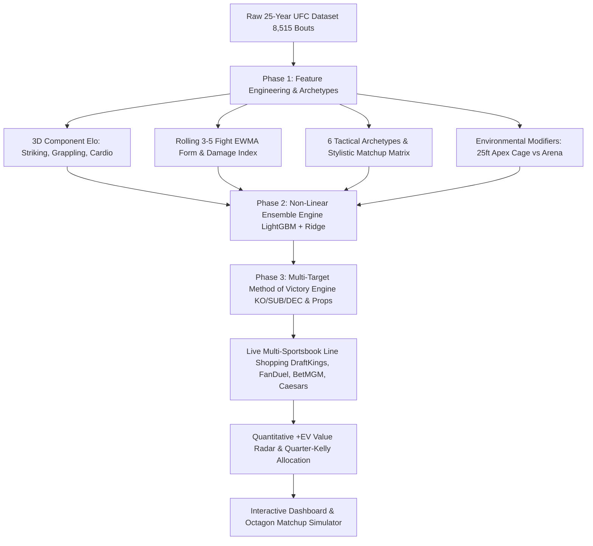

# 🥊 UFC Elo Rating & Value Betting Engine (2001–2026)
### 💎 Non-Linear LightGBM Ensemble, 6-Archetype Tactical Engine & Multi-Target Method of Victory Props

An advanced, production-ready quantitative algorithmic fight prediction and value betting analytics platform for mixed martial arts (UFC). Spanning the **entire modern era (2001–2026, 749 events, 8,515 bouts, 2,540 fighters)** with non-linear walk-forward machine learning, 6-way Method of Victory joint probability distributions, live Vegas & multi-sportsbook line shopping, and Quarter-Kelly risk management.

---

## ⚡ Core Architecture & Engineering Highlights



---

## 🔬 1. Phase 1: Feature Engineering & Domain Physics

### A. Rolling Exponentially Weighted Moving Average (EWMA) Form
Rather than relying solely on static career aggregates, the model continuously computes time-decayed rolling performance over each fighter's last 3–5 bouts:
* **`rolling_slpm` & `rolling_sapm`**: Significant strikes landed and absorbed per minute.
* **`rolling_str_acc` & `rolling_str_def`**: Dynamic striking accuracy and defensive evasion rate.
* **`rolling_td_avg_15m`**: Takedowns landed per 15 minutes of control time.
* **`rolling_damage_index`**: Cumulative head strikes absorbed weighted by defensive failure.
* **`finish_rate_recent` & `win_streak_recent`**: Momentum and finishing frequency trajectory.

### B. 6-Archetype Tactical Classification & Stylistic Interaction Matrix ($W_{\text{style}}$)
Fighters are algorithmically clustered into 6 discrete tactical archetypes with specific rock-paper-scissors matchup modifiers:
1. **🥋 Pressure Wrestler** (e.g., Khabib, Merab, Colby Covington): High takedown frequency ($\ge 2.5/15\text{min}$) and cage control dominance.
2. **🥊 Sprawl-and-Brawler** (e.g., Justin Gaethje, Chuck Liddell, Robert Whittaker): TDD $\ge 75\%$ with heavy knockout power.
3. **🐍 Submission Hunter** (e.g., Charles Oliveira, Demian Maia, Paul Craig): Submission finish ratio $\ge 35\%$ with high guard threat.
4. **🎯 Distance Out-Fighter / Sniper** (e.g., Israel Adesanya, Sean O'Malley, Wonderboy): High distance strike ratio ($>70\%$) and high strike defense ($>58\%$).
5. **🥊 Inside Pressure Boxer** (e.g., Ilia Topuria, Petr Yan, Max Holloway): High volume SLpM ($\ge 4.5$) with continuous forward pace.
6. **⛓️ Clinch Grinder** (e.g., Randy Couture, Daniel Cormier): High cage control and dirty boxing durability.

### C. Environmental & Contextual Modifiers
* **Octagon Dimension**: Detects **UFC Apex 25ft Small Cage** ($518\text{ sq ft}$, $44\%$ less floor area, $+12\%$ finish rate) vs **Standard 30ft Arena Octagon** ($746\text{ sq ft}$).
* **High Altitude ($\ge 4,000\text{ ft}$)**: Identifies altitude venues (Salt Lake City, Denver, Mexico City) applying cardiovascular penalties to fighters with low Cardio Elo.

---

## 🌲 2. Phase 2: Non-Linear Ensemble Modeling (LightGBM + Calibrated Ridge)

Evaluated via **Walk-Forward Expanding Window Validation** across **5,867 out-of-sample modern era bouts**:

| Model Architecture | Out-of-Sample Accuracy | Brier Score (Calibration) | Log-Loss |
| :--- | :---: | :---: | :---: |
| **Standard Base Elo** | 76.99% | 0.1951 | 0.5784 |
| **Calibrated Logistic ML** | 77.30% | 0.1606 | 0.4933 |
| **LightGBM Boosted Trees** | **77.67%** | 0.1614 | 0.4979 |
| **Phase 2 Non-Linear Ensemble** | **77.47%** | **0.1592** | **0.4901** |

### Top Non-Linear Feature Drivers (LightGBM Information Gain):
1. `elo_diff`: Effective ratings differential.
2. `card_elo_diff`: Cardiovascular endurance retention in rounds 3–5.
3. `str_elo_diff`: Striking volume and knockdown differential.
4. `grp_elo_diff`: Takedown threat and control time dominance.
5. `age_cliff_diff`: Non-linear physiological age cliff degradation.
6. `str_acc_diff`: Rolling strike accuracy.
7. `tdd_diff`: Takedown defense grappling neutralization.

---

## 🎯 3. Phase 3: Multi-Target Method of Victory & Round Prop Engine

Computes exact 6-way joint probability distributions and round proposition betting lines:

$$\begin{bmatrix}
P(\text{F1 by KO/TKO}) \\
P(\text{F1 by Submission}) \\
P(\text{F1 by Decision}) \\
P(\text{F2 by KO/TKO}) \\
P(\text{F2 by Submission}) \\
P(\text{F2 by Decision})
\end{bmatrix}$$

* **Over/Under 1.5 & 2.5 Rounds**: Computed from weight-class historical baseline finish rates, fighter chin health, and submission density.
* **Fight Goes the Distance**: Probability of a decision outcome vs early stoppage.

---

## 💰 4. Live Value Betting Radar & Multi-Sportsbook Line Shopping

* Scans real upcoming UFC fight cards across global sportsbooks:
  * **DraftKings**, **FanDuel**, **BetMGM**, **Caesars**, **BetRivers**, **Kalshi**, **Polymarket**.
* Highlights the highest-paying bookmaker (`⭐ EN İYİ`) for each betting opportunity.
* **Quarter-Kelly Bankroll Staking**:
  $$f^* = \max\left(0, \min\left(0.05, 0.25 \times \frac{b \cdot p - q}{b}\right)\right)$$

---

## 🚀 Quickstart & Local Setup

```bash
# 1. Clone repository
git clone https://github.com/cinarsinandemirci/ufc-elo-system.git
cd ufc-elo-system

# 2. Create virtual environment & install dependencies
python -m venv .venv
source .venv/bin/activate  # On Windows: .\.venv\Scripts\activate
pip install -r requirements.txt

# 3. Launch Dashboard & Live API
python app.py
```
Open **`http://localhost:5000`** in your browser.

---

## 📜 License
MIT License. Built for sports analytics, quantitative modeling, and data science research.
